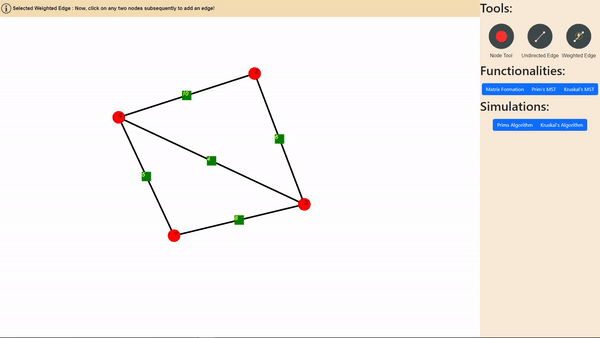

# Graph Simulator 
- This is web application for simulation of graph related various algorithms!
- This project is a web-based graph simulator implemented using vanilla JavaScript and Bootstrap. It provides functionality to visualize and interact with graphs, as well as simulate two popular graph algorithms: Prim's and Kruskal's algorithms for finding minimum spanning trees.

## Features
- Visualize graphs with nodes and edges.
- Add nodes interactively. 
  
- Adding edges interactively. 
  
- Simulate Prim's algorithm to find the minimum spanning tree.
  
- Simulate Kruskal's algorithm to find the minimum spanning tree.
  

## Getting Started
To run this project locally, follow these steps:
1. Clone this repository to your local machine
`git clone https://github.com/HenilMistry/GraphSimulatorWeb.git`
2. Navigate to the project directory
3. Open the `index.html` file in your web browser to launch the application.

## Usage
- **Graph Visualization**: Use the mouse to interact with the graph canvas. Click to add nodes and click and drag between nodes to add edges.
- **Prim's Algorithm**: Click on the "Prim's Algorithm" button to start the simulation. The algorithm will find the minimum spanning tree of the current graph and highlight the edges forming the tree.
- **Kruskal's Algorithm**: Click on the "Kruskal's Algorithm" button to start the simulation. The algorithm will find the minimum spanning tree of the current graph and highlight the edges forming the tree.

## Technologies Used
- Vanilla JavaScript: For implementing the core logic and algorithms.
- Bootstrap: For styling and responsive layout.

## Contributing
Contributions are welcome! If you find any bugs or want to suggest improvements, please open an issue or submit a pull request.

## License
This project is licensed under the MIT License - see the [LICENSE](LICENSE) file for details.
